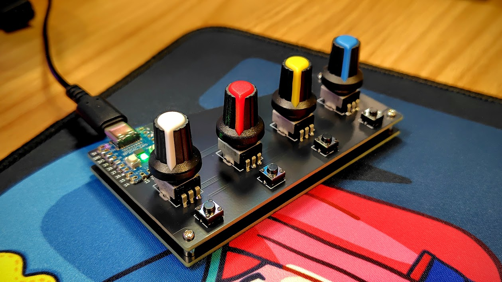
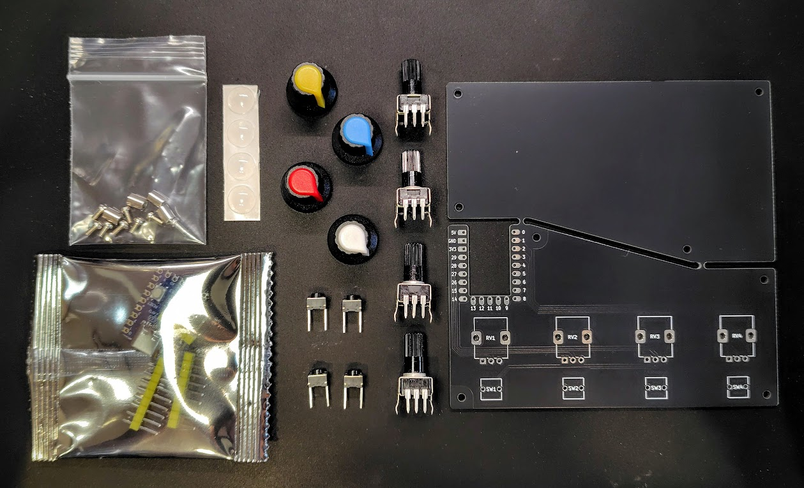

# MCMM

## 🎛️ 概要

**MCMM**（MIDI Controller for MIDI Mixer）は、[MIDI Mixer](https://midi-mixer.com/)を使ってアプリごとの音量を手元で簡単に調整できる、コンパクトなボリュームミキサーです。入手しやすい安価な音量調節デバイスが欲しかったので作りました。  

4つのノブと4つのボタンを搭載し、アプリごとの音量調整だけでなく、マスターボリュームやマイク（ライン入力）の調整にも対応。
さらに、最初はミュートに設定されている各ボタンにはメディアキー（再生・一時停止など）やキーボードのキー入力、ショートカット操作（Ctrl+C や Ctrl+V など）、ワンボタンでのアプリ起動も割り当て可能です。
そのため、簡易的なマクロパッドとしても活用できます。  

Windows10/11 対応。  

## 🛠️ 組み立て方法

[ビルドガイド](build-guide.md)をご参照ください。  
組み立て方法やファームウェアの書き込み方法、プロファイルの設定などが記載されています。  
組み立てを行う前に、下記のパーツが揃っていることを確認してください。

## 📦 必要な部品

### キットとして購入できるもの

| 部品                               | 数量  | 備考                                      |
|------------------------------------|-------|-------------------------------------------|
| PCB                                | 1     | 基板にはボトムプレートが含まれます           |
| RP2040-zero                        | 1     | マイコンボード                             |
| 可変抵抗 10kΩB                      | 4     | 基板取付用 RV09など                        |
| ボリュームノブ                      | 4     | キット付属品はローレットタイプ 軸経6mm      |
| タクタイルスイッチ (6x6x5mm)        | 4     | 2pinのもの　                              |
| M2ネジ (4mm)                       | 8     | 取り付け用ネジ                            |
| M2スペーサー (5mm)                 | 4     | 基板の間隔を調整するためのスペーサー        |
| ゴム足                             | 4     | 装置を安定させるためのゴム足                |

  

### 別途用意するもの
※100円ショップなどで購入可能

| 部品             | 数量 | 備考                    |
| :------------- | :- | :-------------------------- |
| USB TYPE-Cケーブル | 1  | データ通信対応のもの　  　 |

### 組み立てに必要な工具

- はんだごて
- はんだ
- プラスドライバー（M2ねじが回せるもの）
- ニッパー

### あると便利なもの

- マスキングテープ（部品仮止め用に便利です）

## 🛒 購入先
[Booth](https://euclid76.booth.pm/items/6890234)  

## 🎹 MIDI信号仕様

MCMMは、MIDIコントローラーとして以下のMIDI信号を送信します。

**ボリュームノブ（Control Change）**
- ボリューム01：CC 70
- ボリューム02：CC 71
- ボリューム03：CC 72
- ボリューム04：CC 73

**ボタン（Note On）**
- ボタン01：Note 60（Ch.1）
- ボタン02：Note 61（Ch.1）
- ボタン03：Note 62（Ch.1）
- ボタン04：Note 63（Ch.1）

## 📚 使用ライブラリとライセンス

MCMMは以下のライブラリを使用しています：
- [Control Surface](https://github.com/tttapa/Control-Surface)
- [Adafruit NeoPixel](https://github.com/adafruit/Adafruit_NeoPixel)
