# MCMM ビルドガイド
※必要な部品が揃っていることを事前に確認してから作業に取り掛かってください。
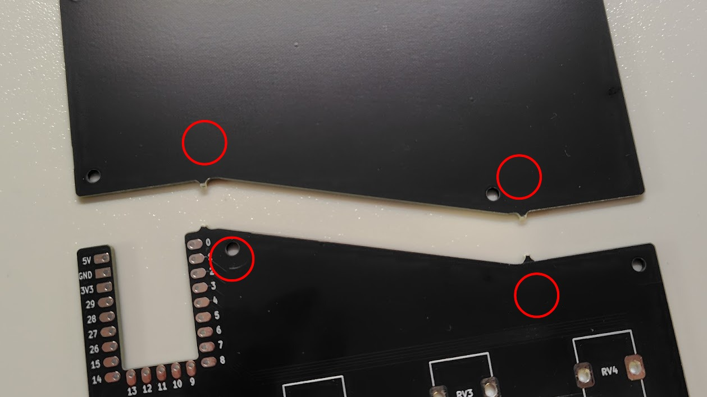

## 組み立て

### 1. メイン基板とボトムプレートを切り離す  
基板とボトムプレートが一体になっているので、赤枠部分を持ち少しずつ曲げて折り、メイン基板とボトムプレートを切り離してください。  

切り離した箇所の余分な部分が気になる場合はニッパーなどでカットし、ヤスリがけを行ってください。
例ではニッパーで余った部分をカットしています。  
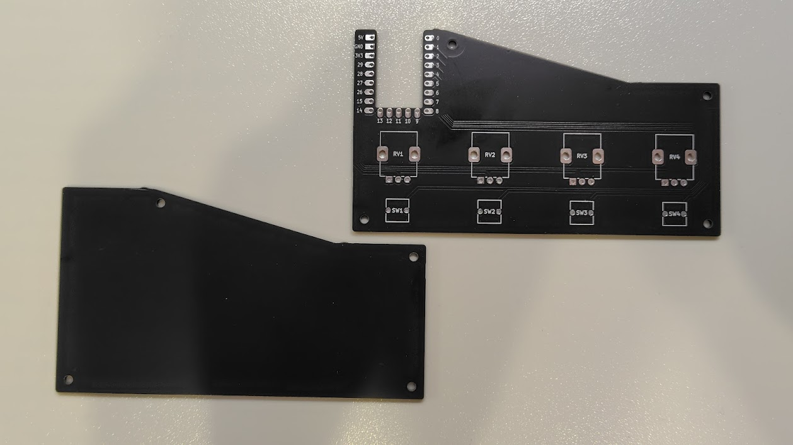

### 2. マイコンボード（RP2040-zero）の取り付け  
はんだ付けが必要なピン番号は以下の通りです。  
右：1, 2, 3, 4  
左：GND, 3V, 29, 28, 27, 26  
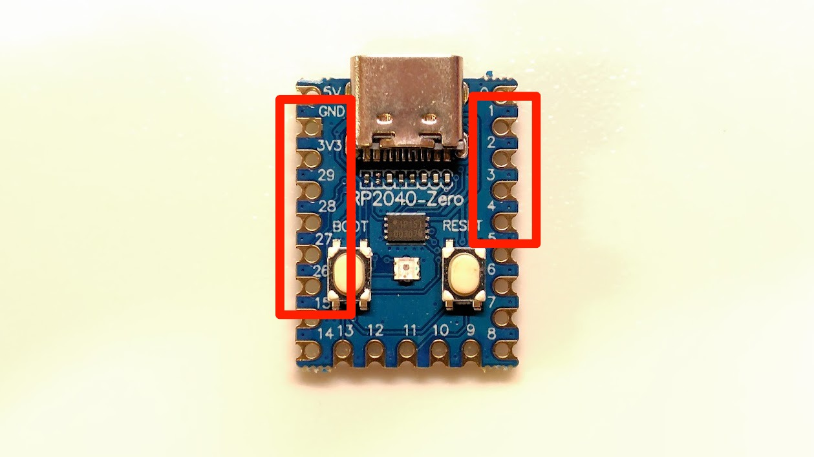

基板の裏側から仮固定用のピンヘッダー（RP2040-zeroに付属）を右側と下側に差し込みます。  
※ピンヘッダーはあくまで仮固定用です。  
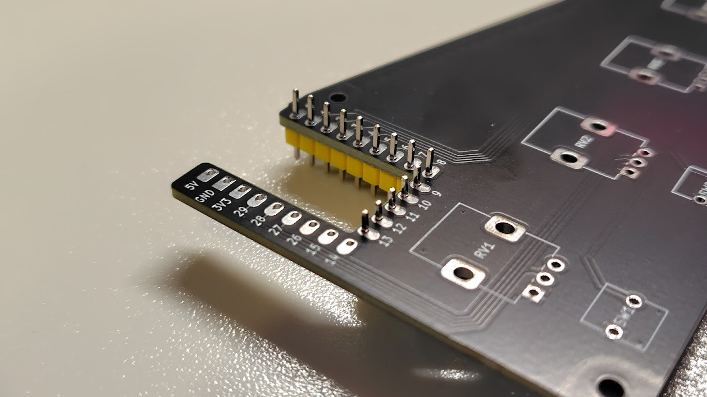

基板上にマイコンボードを仮固定します。  
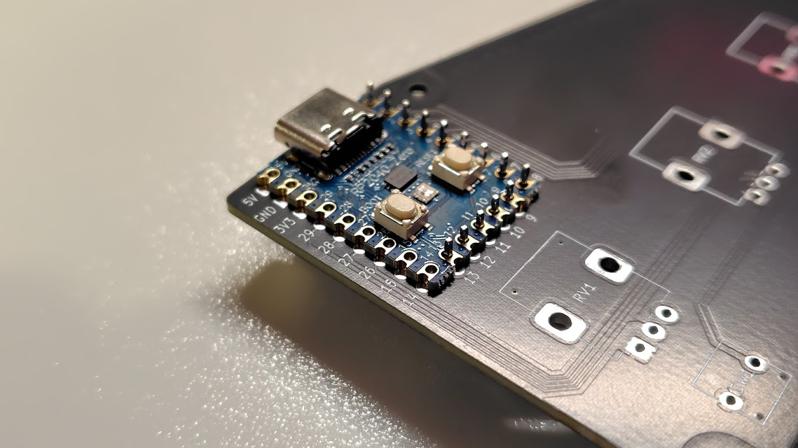

横のスリット部分でマイコンボードの**左側のみ**をはんだ付けします。  
(GND, 3V, 26, 27, 28, 29)  
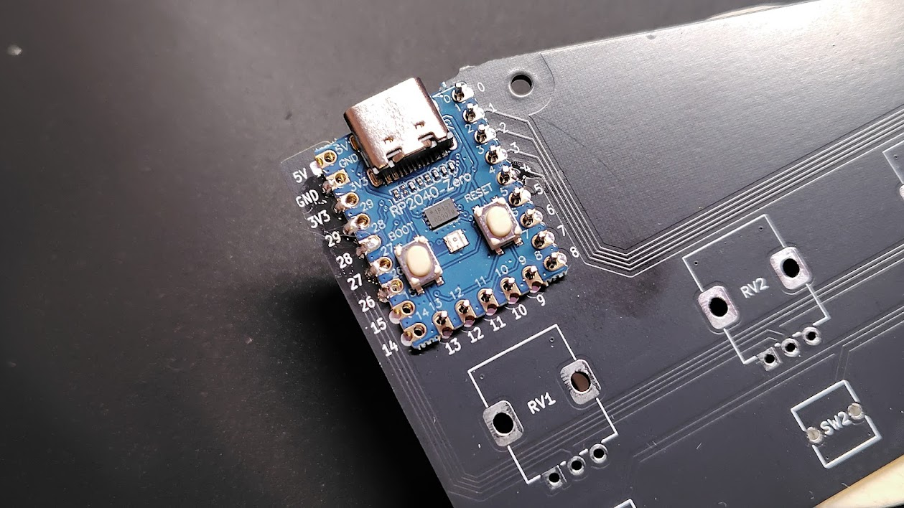

先ほど仮固定のために差し込んだピンヘッダーを取り外します。  
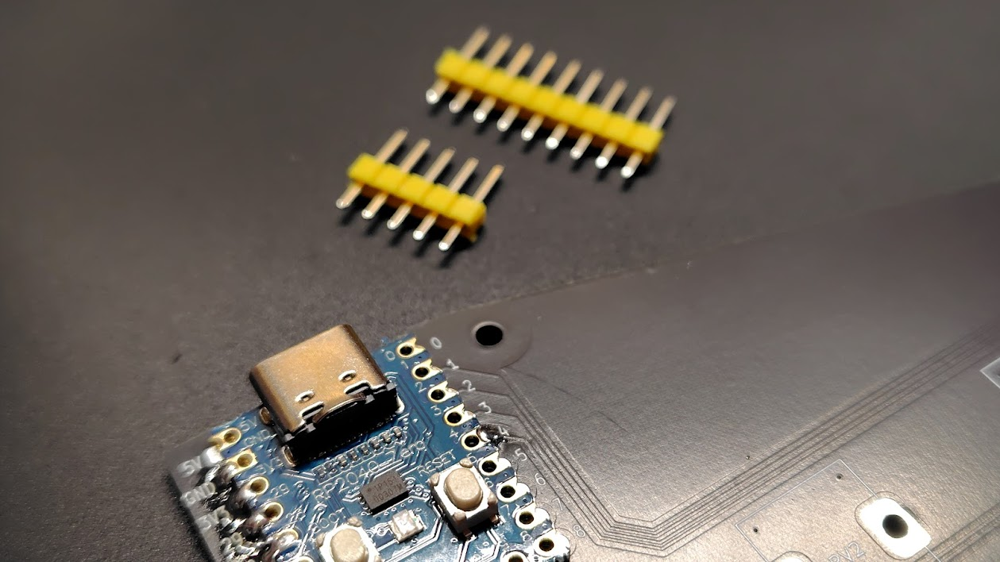

残りのピン (1, 2, 3, 4) をはんだ付けします。  
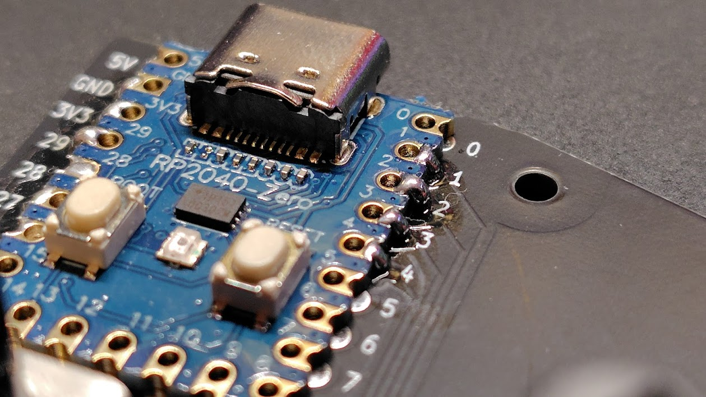

より強固に固定したい方は、必要なピン以外の部分（マイコンボード下部など）もはんだ付けしてください。

### 3. タクタイルスイッチの取り付け  
タクタイルスイッチを差し込みます。  
スイッチの向きはどちらでも動作に問題はありませんが、統一した方が見た目が整います。  
（例では銀の点がある面を表側にしています。）  
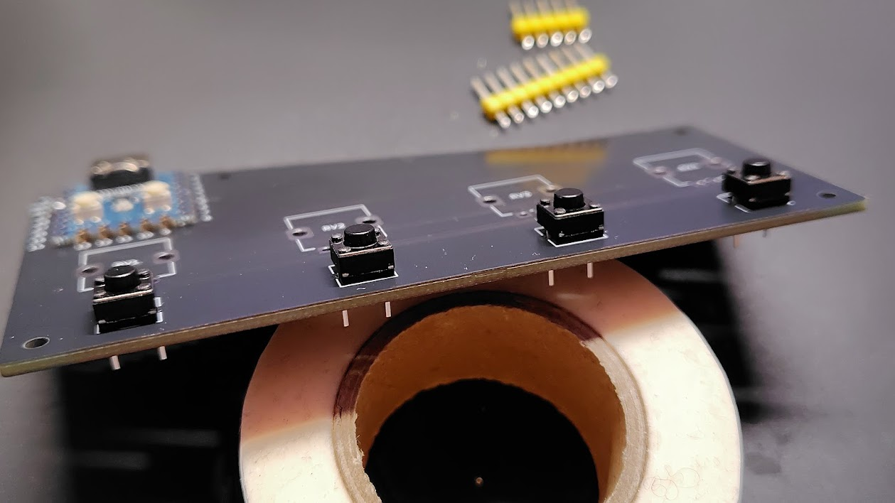

部品が落下しないよう、マスキングテープなどで仮固定するか、足を軽く曲げて取り付けます。  
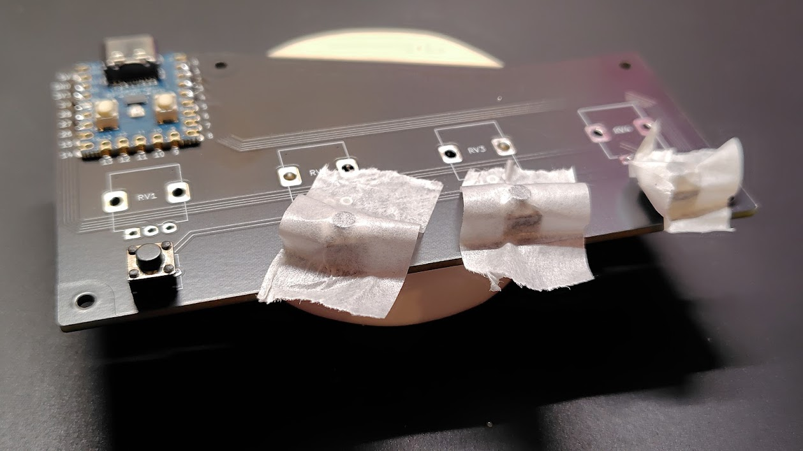

基板を裏返してはんだ付けします。  
部品が浮かないように軽く押し付けながら作業してください。  
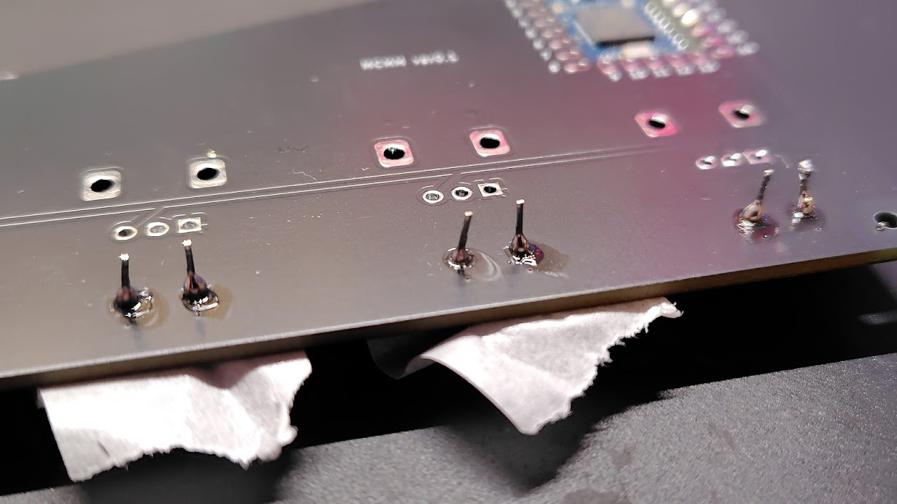

### 4. 可変抵抗の取り付け  
基板に部品を差し込みます。  
可変抵抗が基板の穴に入らない場合は、手で軽く足を曲げて調整してください。  
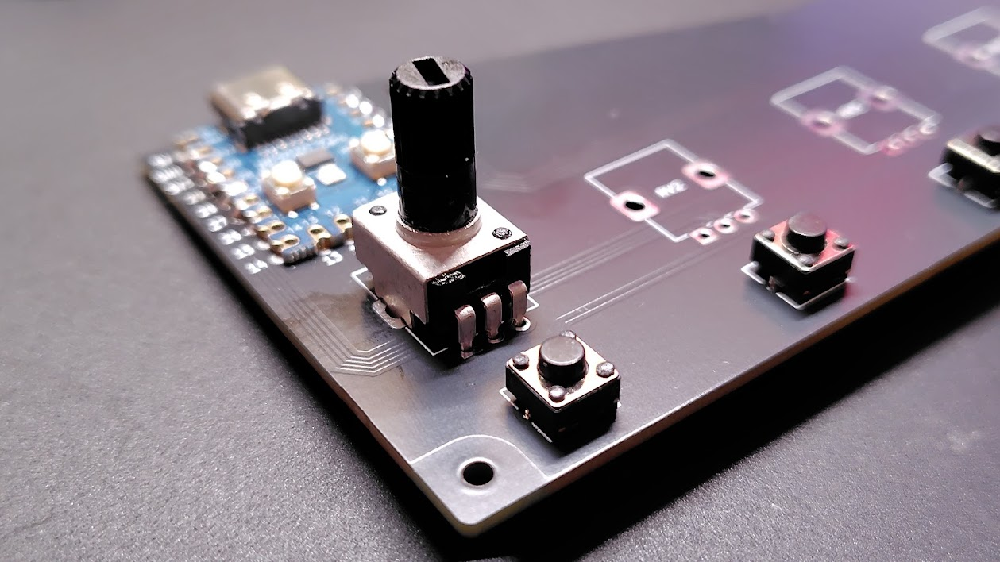

赤マルのピン部分をはんだ付けします。  
隣のピン同士がはんだでつながらないよう注意してください。  
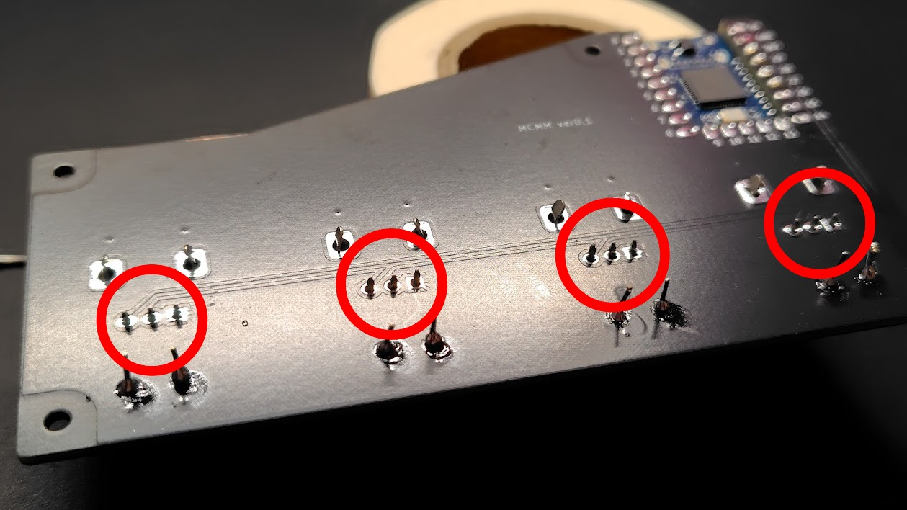

左右の取り付け足は必須ではありませんが、はんだ付けするとよりしっかり固定されます。  
（例でははんだ付けをしていません）  
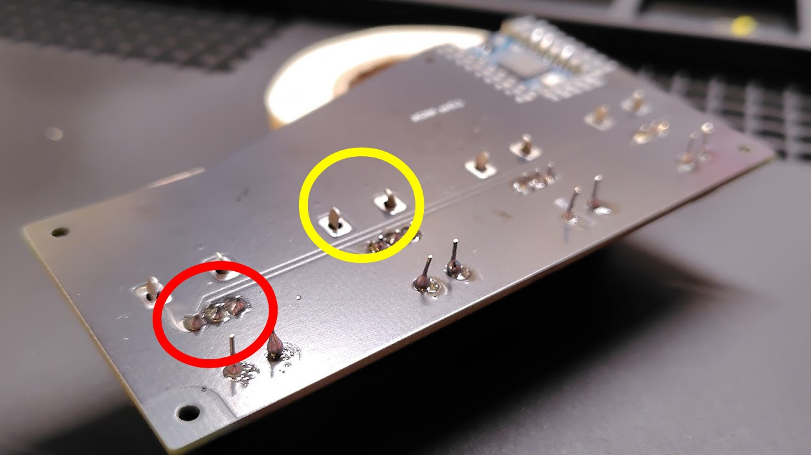

### 5. 不要なピンの切り取り  
ニッパーでタクタイルスイッチの余分な足を切り取ります。  
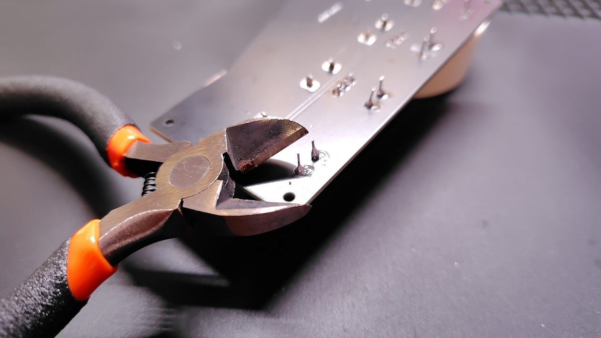

### 6. ネジとスペーサーの取り付け  
※部品が小さいので、作業中に落下・紛失しないよう注意してください。

ボトムプレートにM2ネジを差し込みます。  

スペーサーを取り付けます。  
この段階では手締めでも問題ありません。  

メイン基板を上に重ねて、ネジを取り付けます。  
その後、すべてのネジを増し締めしてください。  

### 7. ノブの取り付け  
まずは可変抵抗をすべて左に回しておきます。
（ボリューム最小の状態）  

ノブを可変抵抗に取り付けます。  
ノブのラインを可変抵抗土台の角に合わせると取り付けやすくなります。  

### 8. ゴム足の貼り付け  
底面にゴム足を貼り付けます。  
正面側（ボタンがある方）はなるべく手前ギリギリに貼ると、ボタン操作時に安定します。  

---

## ファームウェアの書き込み

### 1. GitHubからファームウェアをダウンロード  
必要なファームウェアファイルを [GitHub] からダウンロードします。

### 2. マイコンボードをリセットしながらPCに接続  
リセットボタンを押しながらUSBでPCに接続します。

### 3. ファームウェアをドラッグアンドドロップ  
ダウンロードしたファームウェアファイルを、マイコンボードのドライブにドラッグ＆ドロップします。

### 4. 緑色に光ったら成功  
書き込みが完了すると、緑色のLEDが点灯します。

---

## ソフトウェア設定

### 1. MIDI Mixerをインストール  
[MIDI Mixer](https://midi-mixer.com/) をダウンロードし、インストールします。  
Microsoftストアで「MIDI Mixer」と検索しても表示されます。

### 2. MIDI Mixerを起動  
インストール完了後、MIDI Mixerを立ち上げます。

### 3. プロファイル設定を読み込む  
URL: `xxxxxxxxxxxxxxxxx`  
このURLを **MIDI Mixerが起動した状態でブラウザのURL欄** に入力します。  
MCMMのプロファイル設定が読み込まれ、デバイスとしてMCMMが選択されます。

### 4. アプリを割り当てる  
音量を調整したいアプリケーションを各ボリュームに割り当てます。  
アプリが起動中であれば、プルダウンメニューから割り当てが可能です。  
必要に応じて、スタートアップ登録なども行ってください。

---

お疲れさまでした！  
これでMCMMの組み立てと設定が完了し、使用準備が整いました。
