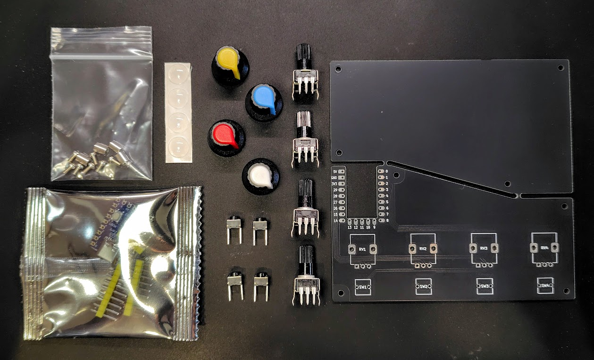
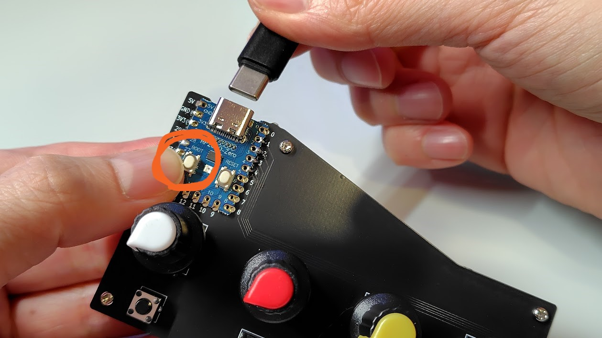
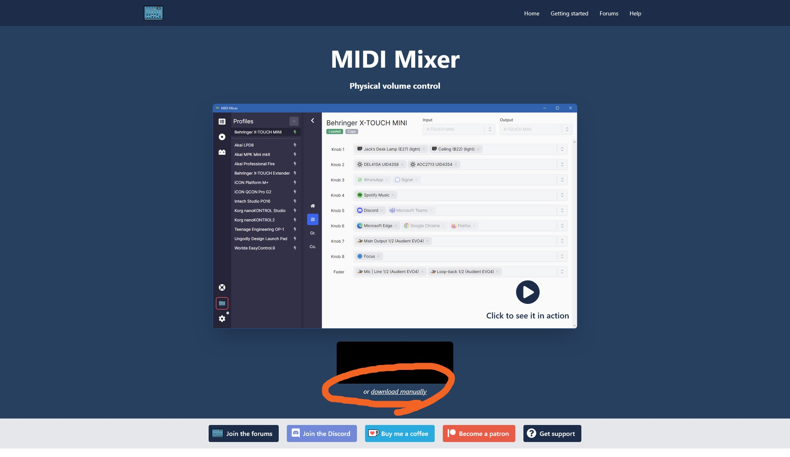
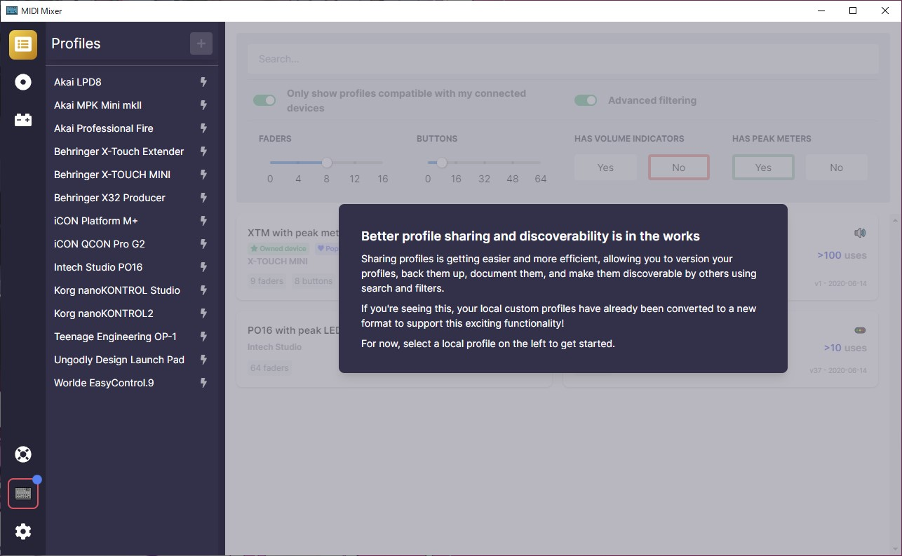
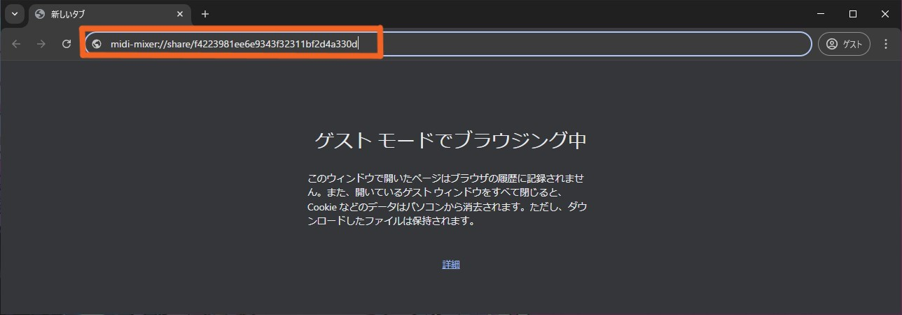
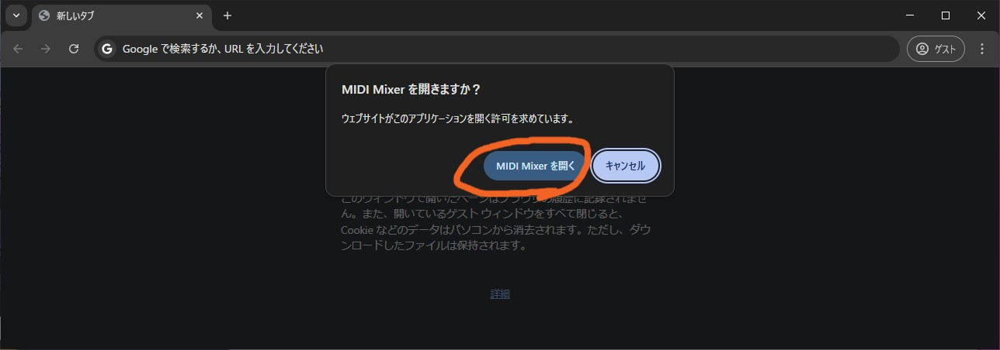
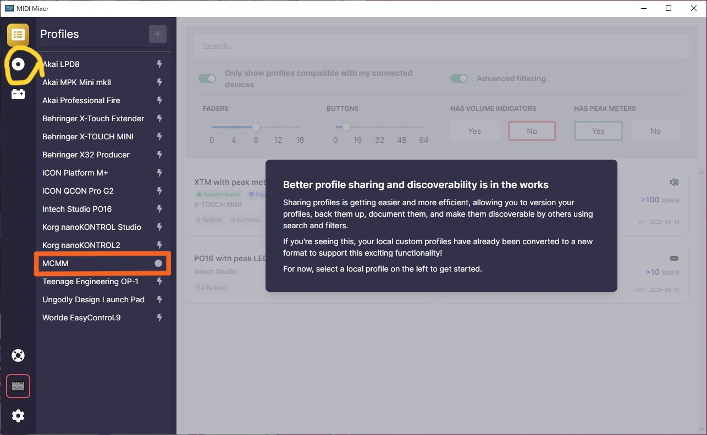
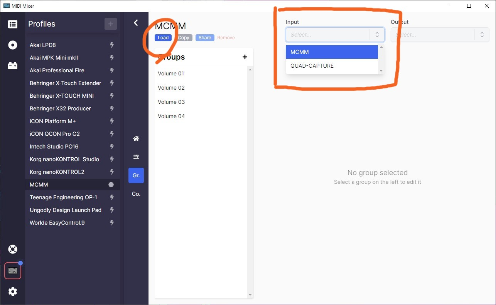
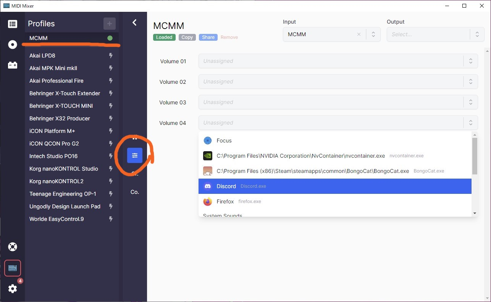
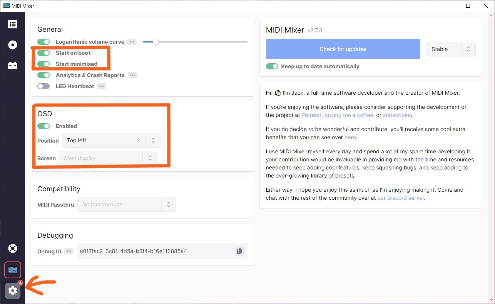

# MCMM ビルドガイド

※作業に取り掛かる前に、[README](https://github.com/Euclid76/MCMM) に記載されている部品リストを確認し、必要な部品が揃っていることを確認してください。  



## 1️⃣はんだ付けと組み立て

### 1. メイン基板とボトムプレートの切り離し
基板とボトムプレートは一体化しています。ニッパーなどで切り離してください。  
刃がうまく入らない場合は、赤枠部分を持って少しずつ曲げ折って切り離してください。  


切り離し跡のバリが気になる場合は、ニッパーでカットし、ヤスリがけしてください。  
（この作業は省略しても問題ありません。以下の画像では余分な部分をニッパーで切除しています）  


### 2. マイコンボード（RP2040-zero）の取り付け
はんだ付けが必要なピン番号は以下の通りです：  
右：1, 2, 3, 4  
左：GND, 3V, 29, 28, 27, 26  


基板の裏側から、仮固定用のピンヘッダー（RP2040-zeroに付属）を右側と下側に差し込みます。  
**※ピンヘッダーはあくまで仮固定用です。**  


ピンを差し込んだ状態で、マイコンボードを上に乗せて仮固定します。  


マイコンボードのはんだ付けを行います。  
まずは**ピンヘッダーが刺さってない左側のみ**はんだ付けしてください。  
スリットにはんだを流し込むようにします。  
（必ずはんだ付けが必要な場所：GND, 3V, 29, 28, 27, 26）


仮固定に使ったピンヘッダーを取り外します。  


次に、マイコンボード右側をはんだ付けします。  
（必ずはんだ付けが必要な場所：1, 2, 3, 4）  
より強固に固定したい場合は、必要ピン以外にもはんだ付けしてください。


### 3. タクタイルスイッチの取り付け
タクタイルスイッチを基板に差し込みます。  
向きに機能上の影響はありませんが、見た目を揃えるために方向を統一するのが望ましいです。  
（例ではシルバーの点がある面を表側にしています）  


部品が抜け落ちないよう、マスキングテープで仮固定するか、足を軽く曲げて固定します。  


裏返して、部品が浮かないよう基板を軽く押さえながらはんだ付けします。  


### 4. 可変抵抗の取り付け
基板に4つの可変抵抗を差し込みます。  
もし足が穴に入らない場合は、手で軽く曲げて調整してください。  


赤枠のピンをはんだ付けします。隣同士のピンがはんだでつながらないよう注意してください。  
また画像2枚目黄枠の左右の取り付け足のはんだ付けは必須ではありません、補強したい方のみはんだ付けをしてください。  
（画像では未はんだ）    


### 5. 不要なピンの切除
タクタイルスイッチの余った足をニッパーで切り取ります。  


### 6. ネジとスペーサーの取り付け
**※小さい部品が多いので、紛失にご注意ください。**

ボトムプレートにM2ネジを差し込みます。  


スペーサーを取り付けます。仮止め程度で構いません。  


その上にメイン基板を重ね、ネジで固定します。  
最後にすべてのネジをしっかり締めてください。  


### 7. ノブの取り付け
可変抵抗をすべて左方向（最小）に回しておきます。  


ノブを取り付けます。ラインを可変抵抗の角に合わせると位置決めしやすいです。  


### 8. ゴム足の貼り付け
底面にゴム足を貼ります。  
ボタンのある面（正面側）は、なるべく手前ギリギリに貼ると操作時に安定します。  


  
組み立て作業はこれで完了です。

---

## 2️⃣ ファームウェアの書き込み

### 1. リリースページからファームウェアをダウンロード  
リリースページ、または下記リンクからファームウェア（firmware.uf2）をダウンロードしてください。  
<br>
👉️[コチラからダウンロード](https://github.com/Euclid76/MCMM/releases/download/v1.0.0/firmware.uf2)  
<br>
  

### 2. マイコンをブートモードでPCに接続  
**ブートボタンを押しながら**USBでPCに接続すると、自動的にフォルダが開きます。  
すでに接続してしまった場合は、ブートボタンを押しながらリセットボタンを押してください。  
フォルダの名前は **`RPI-RP2`** です。開いたらボタンから手を離しても大丈夫です。  


### 3. ファームウェアの転送  
ダウンロードしたファームウェアファイル（`firmware.uf2`）を、開いたフォルダにドラッグ＆ドロップします。  


### 4. 緑のLEDが点灯すれば成功  
書き込みが完了すると、マイコンのLEDが緑色に点灯します。  


---

## 3️⃣ソフトウェア設定

### 1. MIDI Mixer のインストール  
[MIDI Mixer](https://midi-mixer.com/) をダウンロード・インストールしてください。  
または、Microsoft Storeで「MIDI Mixer」と検索してインストールすることもできます。  


### 2. MIDI Mixer を起動  
インストールが完了したら、MIDI Mixer を起動します。  


### 3. プロファイルの読み込み  

#### ・ブラウザのURL欄に設定用URLを入力   
```
midi-mixer://share/f4223981ee6e9343f32311bf2d4a330d
```
上記のURLをコピーして、**MIDI Mixerを起動した状態で**ブラウザのURL欄に貼り付け、Enterキーを押してください。 


#### ・MIDI Mixerを開くか確認される  
「MIDI Mixerを開きますか？」といった確認ダイアログが表示されるので、許可してください。  


#### ・MCMMのプロファイルが読み込まれる  
自動的にMCMM用の設定プロファイルが追加されます。  
プロファイル一覧に反映させるため、一度左側の別タブ（例：ボタンやプラグイン）をクリックしてから再度プロファイル一覧タブに戻ってください。  
「MCMM」が一覧に表示されるようになります。  


### 4. デバイスの割り当てとロード  
プロファイル一覧から「MCMM」を選択し、右上の Input デバイスに「MCMM」を指定してください。  
その後、「Load」ボタンを押してプロファイルを有効にします。  


### 5. アプリケーションの割り当て  
プロファイルがロードされた状態で赤丸のアイコンを選択し、各ボリュームに調整したいアプリケーションを割り当てます。  
対象のアプリが起動中であれば、プルダウンメニューから選択できます。  


### 6. その他の設定（任意）  
必要に応じて、MIDI Mixerのスタートアップへの登録や、インジケーターの表示場所の変更なども設定から行えます。  


### ※より詳細な設定方法  
より詳しい割り当て方法や各種設定については、[MIDI mixer help](https://docs.midi-mixer.com/) をご確認ください。  
ご要望が多ければ、簡易マニュアルを別途作成するかもしれません。


---

### ✅ 完了です！
以上でMCMMのセットアップは完了です。  
お疲れさまでした！

使用してみた感想などお待ちしております。  
ご意見・ご要望などありましたら、[X（旧Twitter）@Euclid76](https://x.com/Euclid76) までお知らせください。


